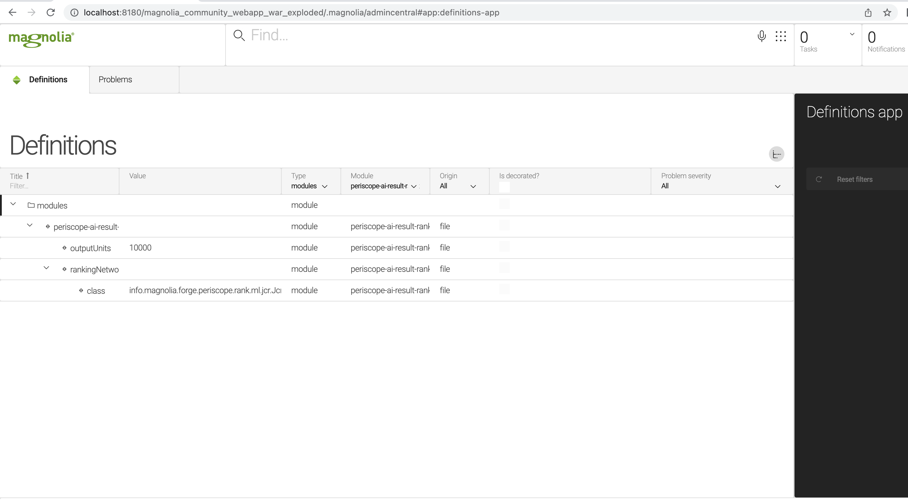
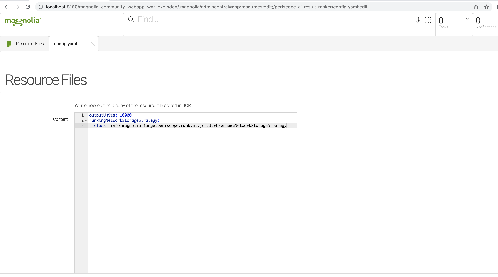
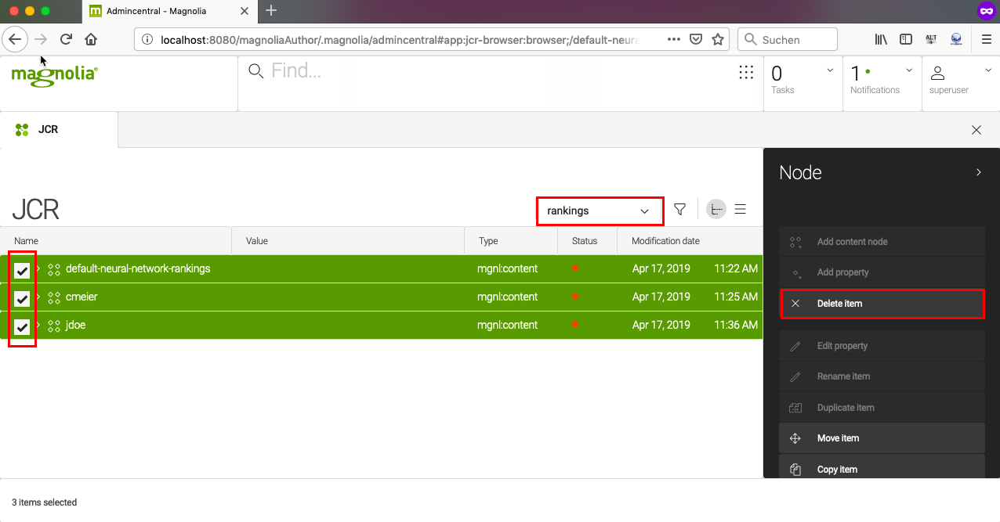

# periscope-ai-result-ranker

[](https://travis-ci.com/magnolia-community/periscope-ai-result-ranker) [](https://www.magnolia-cms.com)

The Periscope Result Ranker module uses neural networks to store Find Bar search results and rank them by relevance. It extends the Periscope modules. The more you search, the more Magnolia learns what you need and the better your search results get. Magnolia makes suggestions and ranks all search results based on what it has learned from previous search patterns and the preferences of each user (local ranking) or all users on a given Magnolia instance (global ranking).
The module learns user preferences to offer better result ranking for subsequent searches. By default, search result rankings are stored per user. You can change the configuration as necessary. For example, you can enable an individual ranking for each user or for selected users only. Additionally, you can configure the memory size of networks to mitigate possible memory consumption issues in large setups.

## Installing

Add the following dependency to your Maven project:

```
<dependency>
    <groupId>info.magnolia.forge</groupId>
    <artifactId>periscope-ai-result-ranker</artifactId>
    <version><LATEST_STABLE_VERSION></version>
</dependency>
```

## Configuration

The module comes with the following default configuration:
periscope-ai-result-ranker/src/main/resources/periscope-ai-result-ranker/config.yaml

```
outputUnits: 10000
rankingNetworkStorageStrategy:
    class: info.magnolia.forge.periscope.rank.ml.jcr.JcrUsernameNetworkStorageStrategy
```

### Properties

| Property | Description |
| ----------- | ----------- |
|`outputUnits` | **required**, *default* is `10000`<br>The memory size of neural networks.<br>The result-ranking system requires memory (heap space) and disk space per unit for each user (local ranking) or instance (global ranking). You can adjust the size of the memory used per unit to mitigate possible memory consumption issues (see [Result Ranker memory size](https://wiki.magnolia-cms.com/display/WIKI/Periscope+Result+Ranker+module#PeriscopeResultRankermodule-ResultRankermemorysize)). |
|`rankingNetworkStorageStrategy` | **required** <br>The result-ranking memory strategy.<br>The default strategy stores result rankings per user. Other strategies are possible (see [Result Ranker strategy](https://wiki.magnolia-cms.com/display/WIKI/Periscope+Result+Ranker+module#PeriscopeResultRankermodule-ResultRankerstrategy)). <br>To adjust the strategy, set the `class` property accordingly. |
|`class` | **required**, *default* is `info.magnolia.forge.periscope.rank.ml.jcr.JcrUsernameNetworkStorageStrategy`<br>Other possible values must be a subtype of<br>`info.magnolia.forge.periscope.rank.ml.RankingNetworkStorageStrategy`. |

## Understanding configuration to optimize memory footprint

The Periscope Result Ranker module creates a certain number of memory units. The total number of memory units depends on the [Result Ranker strategy](https://wiki.magnolia-cms.com/display/WIKI/Periscope+Result+Ranker+module#PeriscopeResultRankermodule-ResultRankerstrategy). The size of a single memory unit is based on the [Result Ranker memory size](https://wiki.magnolia-cms.com/display/WIKI/Periscope+Result+Ranker+module#PeriscopeResultRankermodule-ResultRankermemorysize).

###  Result Ranker strategy

You can set the Result Ranker strategy via the `class` property of the `rankingNetworkStorageStrategy` property.

#### User-based ranking

This default configuration enables result ranking for each user operating on the author instance. With this strategy, the module creates one neural network for each user. The memory footprint grows with every new user working on an author instance.

Class: `info.magnolia.forge.periscope.rank.ml.jcr.JcrUsernameNetworkStorageStrategy`

#### Role-based ranking

With this strategy, only users with the role `superuser` or `ranker` have local (per-user) ranking memory. Any other users work with the global (per-instance) ranking memory.

Class: `info.magnolia.forge.periscope.rank.ml.jcr.JcrUserRoleNetworkStorageStrategy`

***
**_Tip_**: To keep the memory footprint for the Result Ranker on a minimum level, use the `JcrUserRoleNetworkStorageStrategy` class and do _not_ assign the role `ranker`. Make sure that you have only a few users with the `superuser` role.
***

#### Custom ranking

You can develop your own custom result-ranking strategy. To do this, create a custom class that implements `javadoc:info.magnolia.forge.periscope.rank.ml.RankingNetworkStorageStrategy` and set the `class` property in the configuration accordingly.

###  Result Ranker memory size

You can globally configure the memory size of neural networks. To do so, adjust the `outputUnits` value. The default memory size is `10000`; this value represents the maximum number of Find Bar search results that can be stored and ranked in networks.

Large networks can store more results but use up more memory, while small networks consume less memory but might lose stored results to free up additional memory. Results are removed from networks based on a least-recently-used policy. This ensures that frequent results remain in memory irrespective of when they were added to the networks. You may want to configure the memory size of networks depending on the [Result Ranker strategy](https://wiki.magnolia-cms.com/display/WIKI/Periscope+Result+Ranker+module#PeriscopeResultRankermodule-ResultRankerstrategy).

When you change the `outputUnits` value (e.g. from `10000` to `1000`), you need to clean up the JCR `rankings` workspace. Otherwise, an error will appear when you select a search result. This is because the networks loaded into memory were created using a configuration that no longer exists, rendering any stored results obsolete. When you change the `outputUnits` value, make sure that you delete any stored networks and log into the Magnolia instance again to regenerate networks using the new configuration (see [Clearing Result Ranker memory](https://wiki.magnolia-cms.com/display/WIKI/Periscope+Result+Ranker+module#PeriscopeResultRankermodule-ClearingResultRankermemory)).

##  Changing configuration

The Periscope Result Ranker module configuration resides in `periscope-result-ranker/src/main/resources/periscope-result-ranker/config.yaml`.
The module is deployed as a JAR file, but you can change the configuration by one of the following means:

- [Creating a node in the JCR `resources` workspace (hotfix)](https://docs.magnolia-cms.com/product-docs/6.2/Developing/Resources.html#_1_jcr_resources_workspace)
- [Using a decorator file](https://docs.magnolia-cms.com/product-docs/6.2/Developing/Definition-decoration.html)

The configuration is read by the [Resources module](https://docs.magnolia-cms.com/product-docs/6.2/Developing/Resources.html). Magnolia scans the following for a resource (in this particular order):

- JCR `resources` workspace (hotfix)
- Light module
- Classpath (JAR file)

The Java bean representation of the selected resource is then stored in the registry. The object in the registry may get decorated if a decorator exists for that configuration.

***
**_Tip_**: Storing configuration in the JCR `resources` workspace is useful for hotfixes and patches. This way, an administrator can create an urgent fix and publish it in the Resource Files app. In the long run, we recommend using file-based decoration.
***

The configuration data is read on startup and after it has been changed. The actual data is stored in the module’s configuration registry. You
can look it up using the [Definitions app](https://docs.magnolia-cms.com/product-docs/6.2/Apps/List-of-apps/Definitions-app.html) in **modules** > **periscope-result-ranker**.



***
**_Note_**: If you change the `outputUnits` value, you must delete all existing network data (see [Clearing Result Ranker memory](https://wiki.magnolia-cms.com/display/WIKI/Periscope+Result+Ranker+module#PeriscopeResultRankermodule-ClearingResultRankermemory)).
***

###  Changing configuration with `resources` hotfix

- Open the [Resource Files app](https://docs.magnolia-cms.com/product-docs/6.2/Developing/Resources.html#_resource_files_app).
- Browse to and select **periscope-result-ranker** > **config.yaml**.
- In the action bar, click **Edit file**. The Resource Files app creates a copy of the currently used configuration and stores it in the JCR `resources` workspace.
- Edit the file as necessary.
  
- Click **Save changes**.

###  Changing configuration using decoration

With decoration, you can adapt the currently used configuration (whether it is from a light module, hotfix or JAR file). To learn more about decoration, see [Definition decoration concept](https://docs.magnolia-cms.com/product-docs/6.2/Developing/Definition-decoration.html#_definition_decoration_concept).

A decorator file can reside in any Magnolia Maven module or any light module (see [Definition decorator file location](https://docs.magnolia-cms.com/product-docs/6.2/Developing/Definition-decoration.html#_definition_decorator_file_location)). In the example below, we will create a decorator file in a light module named `test-module`.

Within the light module, create the file `decorations/periscope-result-ranker/config.yaml`.

*`<magnolia.resources.dir>/test-module/decorations/periscope-result-ranker/config.yaml`*
```
outputUnits: 1000
rankingNetworkStorageStrategy:
    class: info.magnolia.forge.periscope.rank.ml.jcr.JcrUserRoleNetworkStorageStrategy
```

### Disabling result ranking

`info.magnolia.periscope.ResultRankerConfiguration` allows you to entirely disable the ranking of Find Bar search results. To do so, set `disabled` to `true` via decoration.

*`<your-light-module>/decorations/periscope-core/config.yaml`*
```
resultRankerConfiguration:
    disabled: true
```

***
**_Note_**: Alternatively, to minimize configuration actions, the same can be achieved if you download the following zip file and extract its contents into your [resources directory](https://docs.magnolia-cms.com/product-docs/6.2/Modules/Light-modules.html#_what_is_magnolia_resources_dir):

[disableRanker.zip](https://docs.magnolia-cms.com/product-docs/6.2/_attachments/disableRanker.zip)
***

This can help you reduce memory usage or resolve potential compatibility issues with DL4J libraries.

##  Clearing Result Ranker memory

The Periscope Result Ranker module stores all user-based, role-based, and custom rankings in the JCR `rankings` workspace. The module creates one node for each memory unit.

Nodes for local (per-user) rankings are named after user names. Nodes for global (per-instance) rankings are named `default-neural-network-rankings`.

To clear the Result Ranker memory:

- Open the [JCR app](https://docs.magnolia-cms.com/product-docs/6.2/Apps/List-of-apps/JCR-Browser-app.html).
- Switch to the `rankings` workspace.
- Select the nodes you want to delete.
- In the action bar, click **Delete item**.
  

## Adding support for Linux armhf and ppc64le

The Periscope Result Ranker module supports the 64-bit versions of Linux, Mac OS and Windows by default. If you use Magnolia in one of the environments below, you must add the corresponding dependencies manually.

**Linux armhf**

```
<dependency>
    <groupId>org.bytedeco.javacpp-presets</groupId>
    <artifactId>openblas</artifactId>
    <classifier>linux-armhf</classifier>
</dependency>
```

**Linux ppc64le**

```
<dependency>
    <groupId>org.bytedeco.javacpp-presets</groupId>
    <artifactId>openblas</artifactId>
    <classifier>linux-ppc64le</classifier>
</dependency>
<dependency>
    <groupId>org.nd4j</groupId>
    <artifactId>nd4j-native</artifactId>
    <classifier>linux-ppc64le</classifier>
</dependency>
```

## IBM WebSphere and Linux
If you experience a JVM crash when running Magnolia 6.2 on IBM WebSphere and Linux, disable the Periscope Result Ranker module by excluding the magnolia-periscope-result-ranker artifact from the dependencies of your project. For example:

```
<dependencies>
    <dependency>
        <groupId>info.magnolia.dx</groupId>
        <artifactId>magnolia-dx-core-demo-webapp</artifactId>
        <type>war</type>
        <exclusions>
            <exclusion>
                <groupId>info.magnolia.periscope</groupId>
                <artifactId>magnolia-periscope-result-ranker</artifactId>
            </exclusion>
        </exclusions>
    </dependency>
    <dependency>
        <groupId>info.magnolia.dx</groupId>
        <artifactId>magnolia-dx-core-demo-webapp</artifactId>
        <type>pom</type>
        <exclusions>
            <exclusion>
                <groupId>info.magnolia.periscope</groupId>
                <artifactId>magnolia-periscope-result-ranker</artifactId>
            </exclusion>
        </exclusions>
    </dependency>
    <dependency>
        <groupId>info.magnolia</groupId>
        <artifactId>magnolia-module-websphere</artifactId>
    </dependency>
</dependencies>
```

## DL4J/ND4J issues
There are limitations on the deep-learning and search features of the [Find Bar](https://docs.magnolia-cms.com/product-docs/6.2/Features/Find-Bar.html), which are provided by the [Periscope](https://docs.magnolia-cms.com/product-docs/6.2/Modules/List-of-modules/Periscope-module.html) and [Periscope Result Ranker](https://wiki.magnolia-cms.com/display/WIKI/Periscope+Result+Ranker+module) modules.

The ND4J library can only be initiated once. Therefore, search result ranking on public instances should be disabled by either changing the configuration of the Periscope Result Ranker module or completely removing the `magnolia-periscope-result-ranker` module from your WAR package. After this modification, the search function will be available but search results will not be ranked. For more details, see [MGNLPER-112](https://jira.magnolia-cms.com/browse/MGNLPER-112).

Related topics
---
- [Periscope module](https://docs.magnolia-cms.com/product-docs/6.2/Modules/List-of-modules/Periscope-module.html)
- [Find Bar](https://docs.magnolia-cms.com/product-docs/6.2/Features/Find-Bar.html)
---